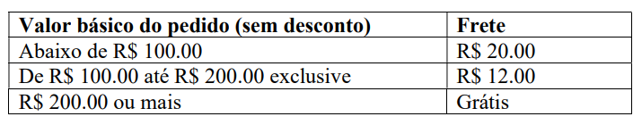
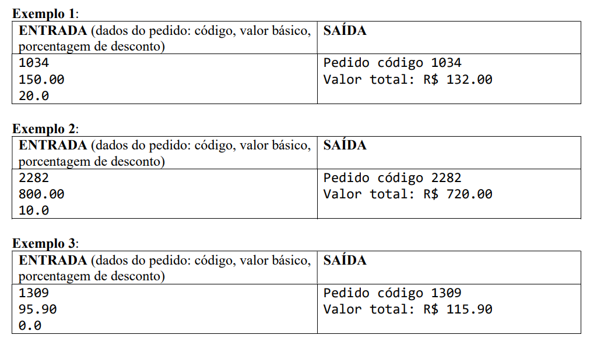
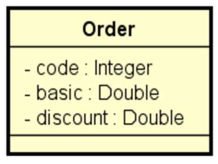
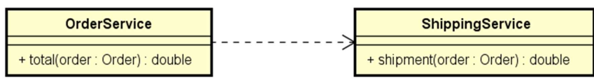

# Formação Desenvolvedor Moderno
### Módulo: Back end
### Capítulo: Componentes e injeção de dependência

<strong>
    Você deve criar um sistema para calcular o valor total de um pedido, considerando uma porcentagem 
    de desconto e o frete. O cálculo do valor total do pedido consiste em aplicar o desconto ao valor 
    básico do pedido, e adicionar o valor do frete. A regra para cálculo do frete é a seguinte:
</strong>

 

Sua solução deverá seguir as seguintes especificações: 

Um pedido deve ser representado por um objeto conforme projeto abaixo: 

A lógica do cálculo do valor total do pedido deve ser implementada por componentes (serviços), cada 
um com sua responsabilidade, conforme projeto abaixo: 

Serviço OrderService: responsável por operações referentes a pedidos. 
Serviço ShippingService: responsável por operações referentes a frete. 
Sua solução deverá ser implementada em Java com Spring Boot. A saída deverá ser mostrada no log 
do terminal da aplicação. Cada serviço deve ser implementado como um componente registrado com 
@Service.
